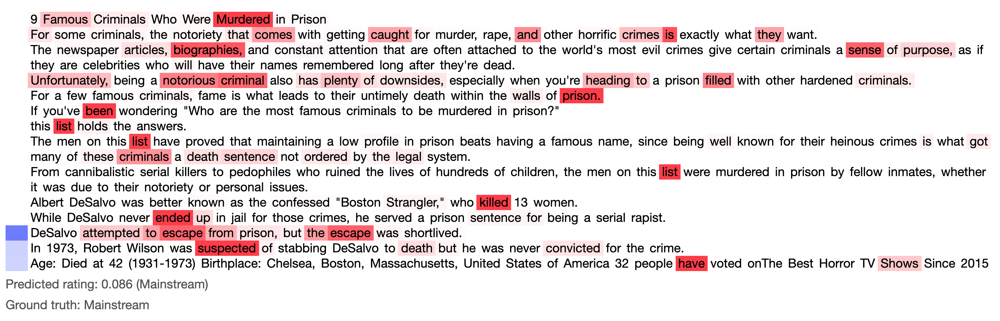
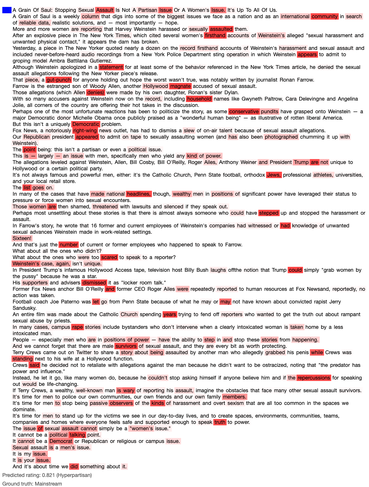

# han-attention-plot
Plot of the attention in a [HAN (Hierarchical Attention Networks)](https://www.cs.cmu.edu/~./hovy/papers/16HLT-hierarchical-attention-networks.pdf).

The blue :large_blue_circle: shades on the left represent sentence-level attention, and the red :red_circle: shades represent word-level attention.

This repository contains already parsed data from a model trained on 644 news articles to dinstiguish _Hyperpartisan_ and _Mainstream_ media (```by-article-train_attn-data.json```).
You can supply your own data as long as it follows the expected format (see [here](https://github.com/AndreFCruz/han-attention-plot/blob/47020e503d50c029d34875f10db9bc1d851b885e/index.html#L252)).

> ```index.html``` was heavily based on [this open-source repo](https://github.com/minqi/hnatt).


### How to
1. Serve the index.html file with an HTTP server.
    ```
    python3 -m http.server 8080
    ```

2. Navigate to ```localhost:8080```

3. Select and load the ```by-article-train_attn-data.json``` file.

4. Choose the index of one of the loaded articles on the top-left text input (there are 644 articles in the provided data file).

5. Click "Run", and repeat from step 4 for different articles.


### Other examples
| | |
|:-:|:-:|
|||
|||
|||
|||
|||

